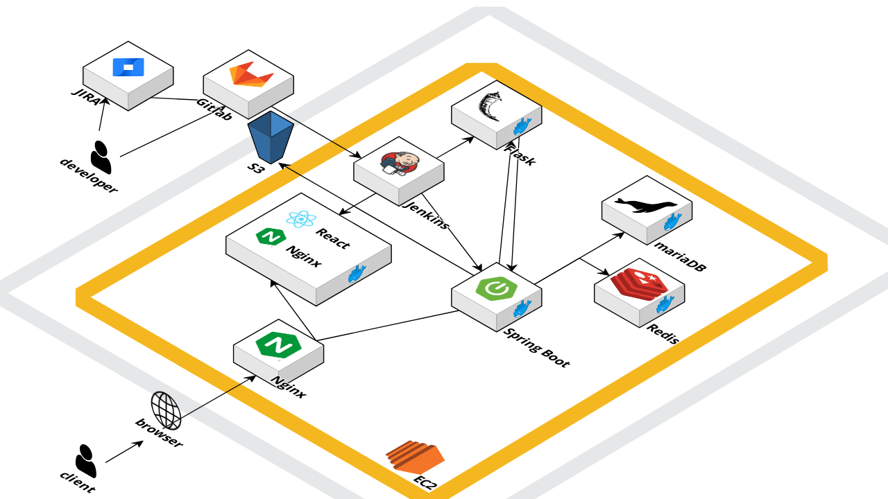

# 댕댕감자

<!--  -->
우리집 강아지 성향 분석하고 여행지까지 추천 받자

---

## ⚙️ System Architecture

---

## 💻 Communication Tool
    

## 🔧 Skills

### 💻 BE Tool

### 💻 FE Tool
      

### 💻 DB Tool

<h3>Infra</h3>

---

## 📄 Project Notion
   <a href="https://www.notion.so/b6a33f1edc5748b0bf6681fc852534e9?pvs=4">
       Notion Link
   </a>

---

## 🐶Page

**댕BTI**

**여행지 추천**

**여행지 검색**

**댕댕네컷**

---

## 👩🏻‍💻 Developers

