# 댕댕감자

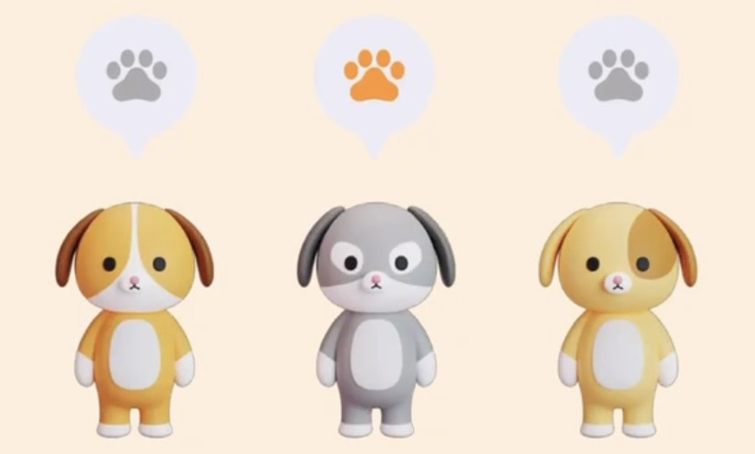 

<b>우리집 강아지 성향 분석하고 여행지까지 추천 받자</b>

---

## 📄 Project Develop Document
   <a href="https://www.notion.so/b6a33f1edc5748b0bf6681fc852534e9?pvs=4">
       <b>Notion</b>
   </a>
    
   <a href="https://www.erdcloud.com/d/ssXp4hRGBCoQJwANT">
      <b>ERD Cloud</b>
   </a>
    
   <a href="https://www.figma.com/file/WQCsV9OflYxubdVaDDu8mx/%EB%8C%95%EB%8C%95%EA%B0%90%EC%9E%90?type=design&node-id=0%3A1&mode=design&t=KKytEyKBx2I0jPvz-1">
      <b>Figma</b>
   </a>
   
---

## ⚙️ System Architecture

---

## 💻 Communication Tool
    

## 🔧 Skills

### 💻 BE Tool

### 💻 FE Tool
      

### 💻 DB Tool

<h3>Infra</h3>

---

## 🐶Page

**[댕BTI]**

강아지의 성격을 분석하고 친구들과 공유까지!!

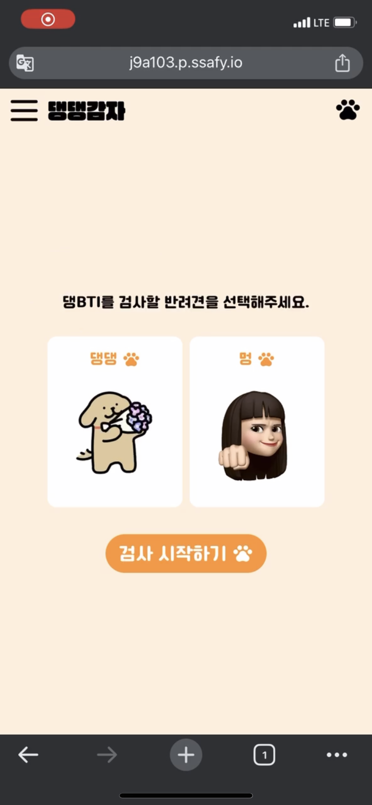 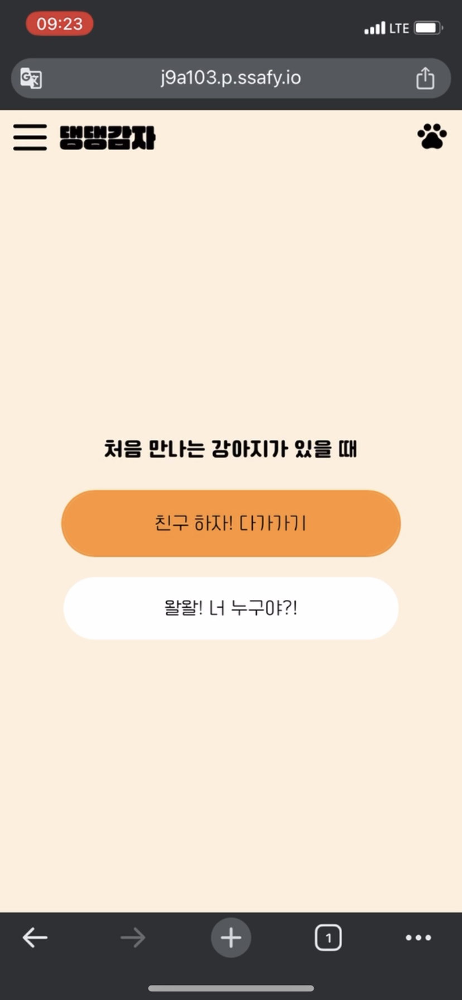 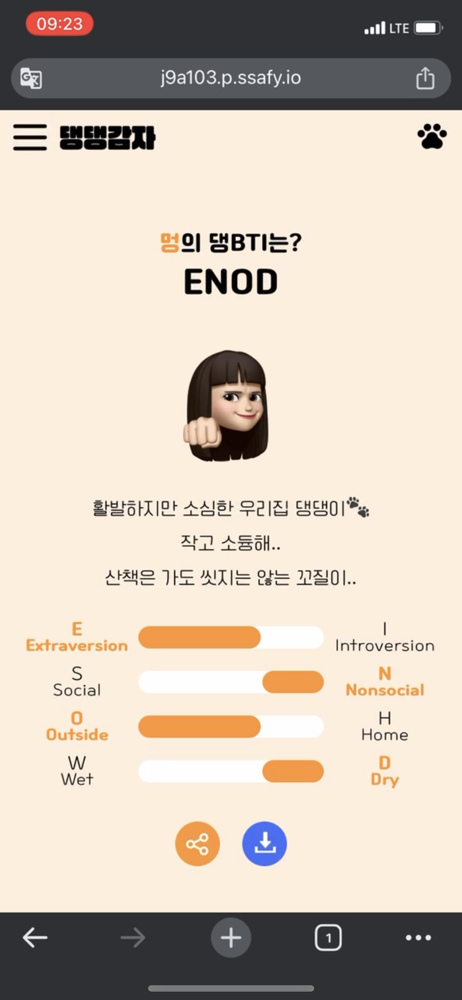

**[여행지 추천]**

강아지 성향 맞춤 강아지별 여행지 추천과 찜/리뷰 기반 사용자 여행지 추천 제공

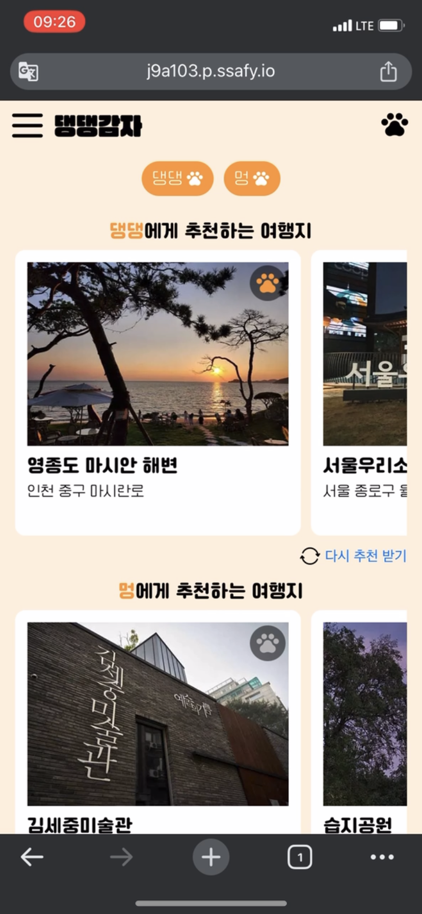 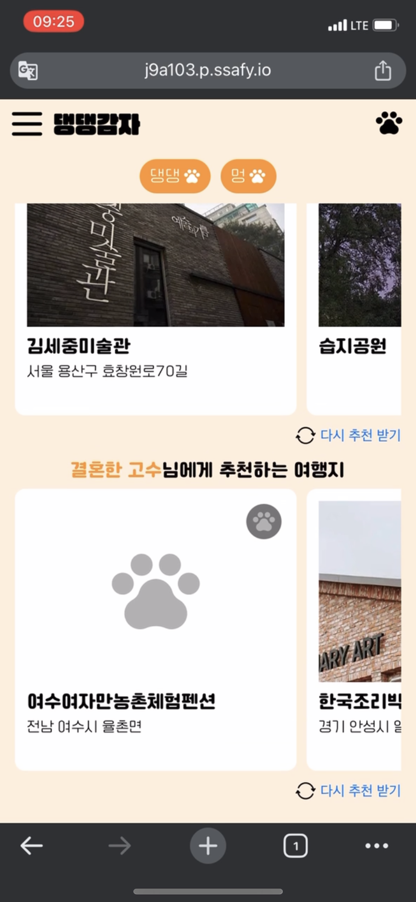 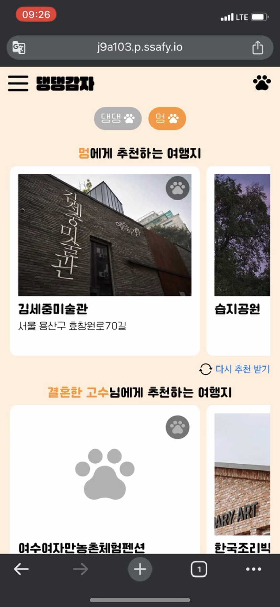

**[여행지 검색]**

카테고리 및 키워드 검색 제공
여행지에 대한 찜과 강아지 별 리뷰 가능 

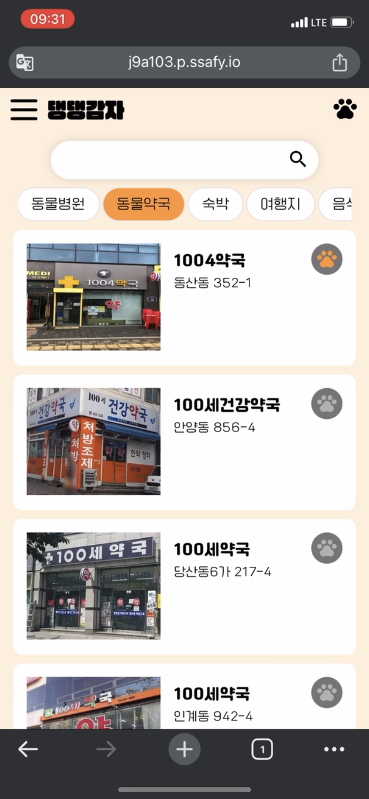 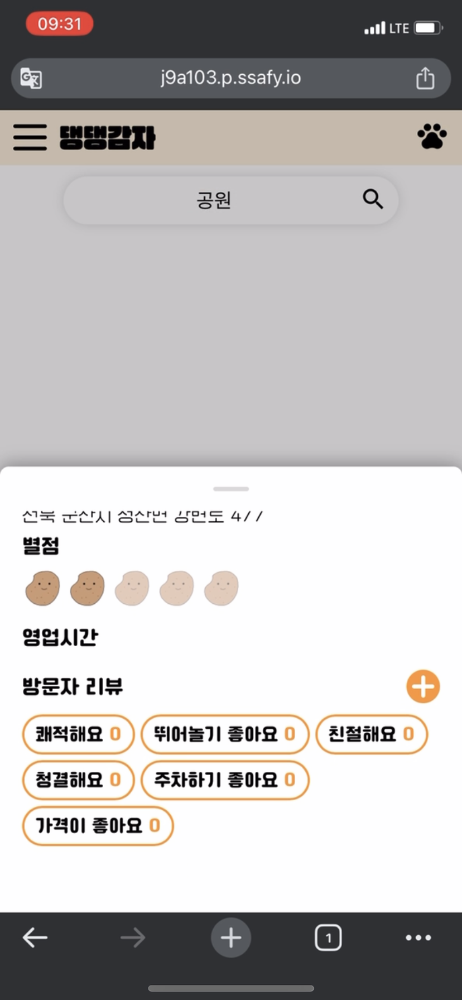 

**[댕댕네컷]**

여행 간 강아지 사진을 가지고 “댕댕네컷” 만들어서 자랑하기
사진첩에서 강아지 사진 골라서 위치 선택해서 이미지로 다운 받자
 

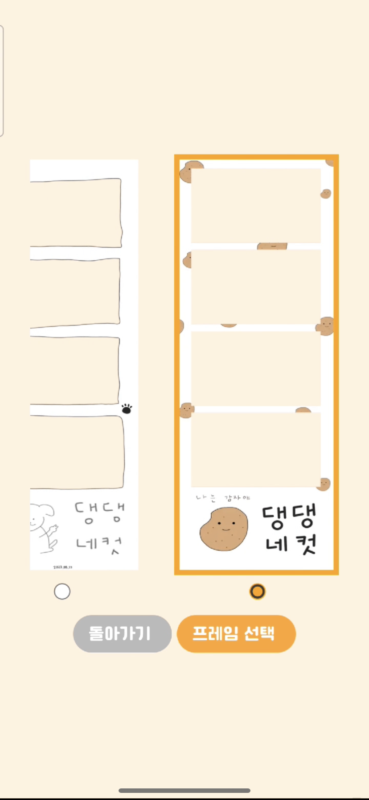 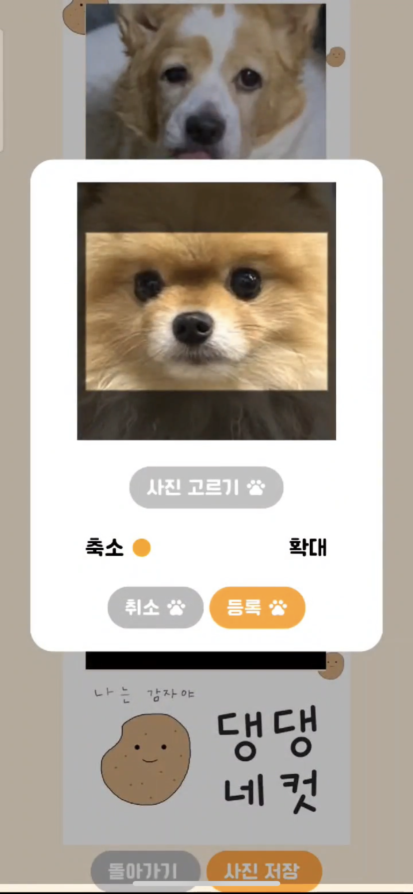 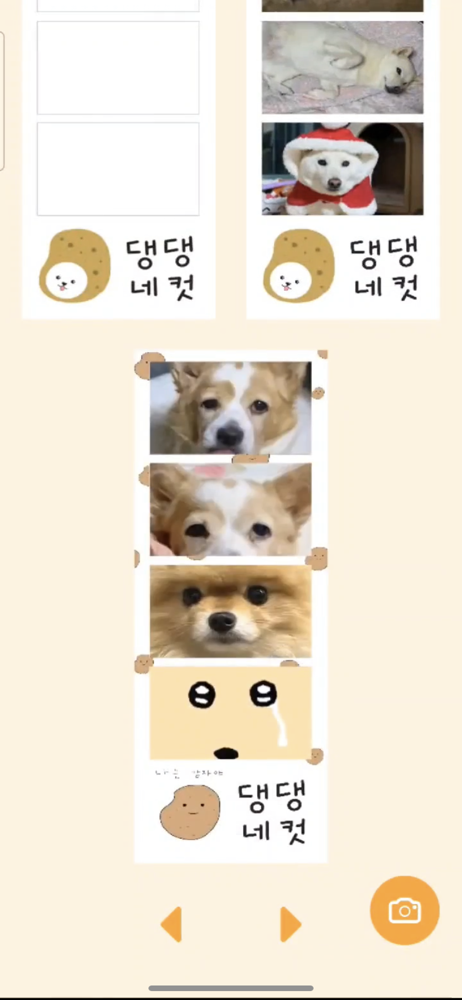

---

## 👩🏻‍💻 Developers

 
  <table>
     <tr align="center">
        <td>
           <B>김혜진</B>
        </td>
      <td>
         <B>김소희</B>
       </td>
      <td>
         <B>백아현</B>
       </td>
      <td>
        <B>이지은</B>
      </td>
      <td>
        <B>임하은</B>
      </td> 
      <td>
        <B>좌정현</B>
      </td>
     </tr>
     <tr align="center">
        <td>
           
            
           <a href="https://github.com/hyejinki">
              <I>hyejinki</I>
           </a>
           
팀장, BE 

        </td>
         <td>
           
            
           <a href="https://github.com/Sohee-Kim-ln">
              <I>Sohee-Kim-ln</I>
           </a>
            
BE

         </td>
         <td>
           
            
           <a href="https://github.com/아현">
              <I>백아현</I>
           </a>
          
BE

        </td>
        <td>
           
            
           <a href="https://github.com/jini11">
              <I>jini11</I>
           </a>
          
BE

        </td>
        <td>
           
            
           <a href="https://github.com/kodms08">
              <I>kodms08</I>
           </a>
          
BE

        </td>
        <td>
           
            
           <a href="https://github.com/imhynni">
              <I>imhynni</I>
           </a>
           
FE

        </td>
     </tr>
  </table>

