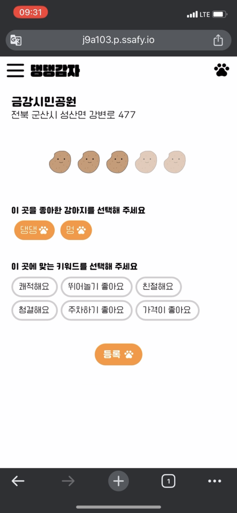

 

# 댕댕감자
댕BTI 검사 결과를 기반으로 반려견 동반 여행지를 추천해드려요. 🐶

# 📄 Project Develop Document
   <a href="https://www.notion.so/b6a33f1edc5748b0bf6681fc852534e9?pvs=4">
       <b>Notion</b>
   </a>
    
   <a href="https://www.erdcloud.com/d/ssXp4hRGBCoQJwANT">
      <b>ERD Cloud</b>
   </a>
    
   <a href="https://www.figma.com/file/WQCsV9OflYxubdVaDDu8mx/%EB%8C%95%EB%8C%95%EA%B0%90%EC%9E%90?type=design&node-id=0%3A1&mode=design&t=KKytEyKBx2I0jPvz-1">
      <b>Figma</b>
   </a>
   
---

# ⚙️ System Architecture

---

# 💻 Communication Tool
    

# 🔧 Skills

### 💻 BE Tool
    

### 💻 FE Tool
     

### 💻 DB Tool
 

### 💻 Infra
   

---

# 🐶Page

## 댕BTI

- 반려견 성향을 분석하고 결과를 공유할 수 있어요.  

  

## 여행지 추천

- 반려견 성향 분석 결과 `댕BTI`를 기반으로 반려견 맞춤 여행지를 추천해요.
- 찜/리뷰를 기반으로 사용자 맞춤 여행지를 추천해요.

  

## 여행지 검색

- 카테고리를 선택하거나 키워드를 통해 검색할 수 있어요.
- 마음에 드는 여행지를 찜하고 강아지별 리뷰를 남길 수 있어요.

  

## 댕댕네컷

- 반려견 사진을 업로드해 `댕댕네컷`을 만들 수 있어요.

  

---

# 👩🏻‍💻 Developers
  <table>
     <tr align="center">
        <td>
           <B>김혜진</B>
        </td>
      <td>
         <B>김소희</B>
       </td>
      <td>
         <B>백아현</B>
       </td>
      <td>
        <B>이지은</B>
      </td>
      <td>
        <B>임하은</B>
      </td> 
      <td>
        <B>좌정현</B>
      </td>
     </tr>
     <tr align="center">
        <td>
           
            
           <a href="https://github.com/hyejinki">
              <I>hyejinki</I>
           </a>
           
팀장, BE 

        </td>
         <td>
           
            
           <a href="https://github.com/Sohee-Kim-ln">
              <I>Sohee-Kim-ln</I>
           </a>
            
BE

         </td>
         <td>
           
            
           <a href="https://github.com/dkgusdkfk">
              <I>dkgusdkfk</I>
           </a>
          
BE

        </td>
        <td>
           
            
           <a href="https://github.com/jini11">
              <I>jini11</I>
           </a>
          
BE

        </td>
        <td>
           
            
           <a href="https://github.com/kodms08">
              <I>kodms08</I>
           </a>
          
BE

        </td>
        <td>
           
            
           <a href="https://github.com/imhynni">
              <I>imhynni</I>
           </a>
           
FE

        </td>
     </tr>
  </table>
